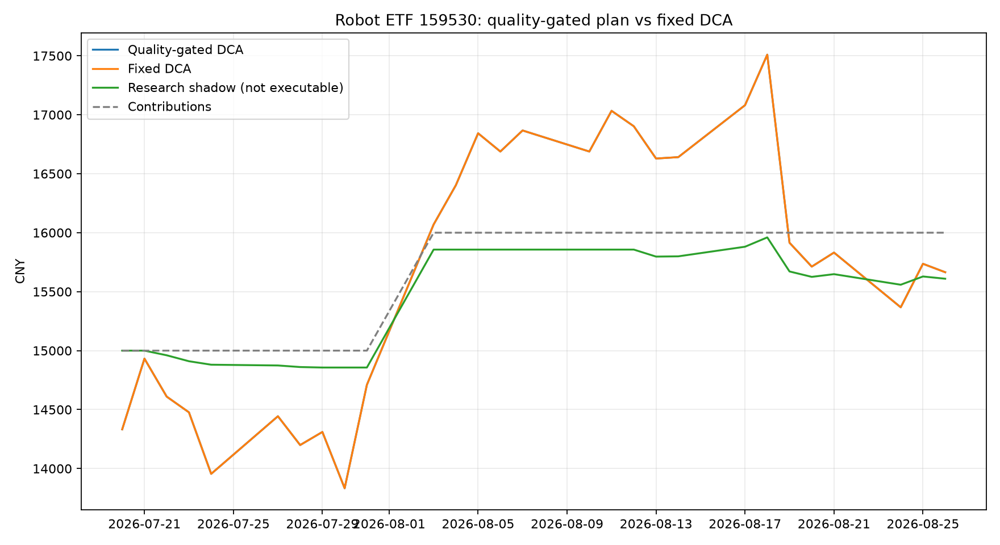

# 机器人ETF模拟账户日报

数据日期：**2026-08-26**

标的：机器人ETF易方达（159530）

最新收盘价：**¥1.3160**

## 未来10日相对沪深300研究信号

- 逻辑回归原始分数：**54.74%**
- 向50%收缩25%后，未来10个交易日跑赢沪深300的预测概率型分数：**51.19%**
- 模型原始研究仓位：**50%**（不可执行）
- 当前使用模型：`shrunk_logistic_regression`
- 当前状态：**仅观察，不可用于自动调仓**

## 下一交易日执行计划

- 可执行目标仓位：**100%**
- 执行政策：**固定定投是唯一可执行模拟**；模型尚未获得仓位控制权。
- 门控原因：回顾性挑战者尚未用新增数据证明长期优于固定定投；当前样本外验证状态：unstable
- 逐日成熟样本门控：**通过**；最近成熟样本50条，Brier=0.2486，AUC=0.5760；最近成熟窗口通过，仅允许不可执行影子卫星仓
- 不可执行影子目标仓位：**20%**。

## 基线优先门控

- 候选模型：**回顾性挑战者** `trend_risk_logistic_v3`；它是在查看既有历史后提出的候选，只能用未来新增数据继续验证。
- 模型研究概率：**51.19%**；批准概率固定为**50.00%**，表示当前没有可执行优势。
- 本月训练集内部隔离验证：样本2235条，Brier=0.2493，AUC=0.5180，**通过**。
- 策略结论：**模型未通过质量门控，当前不具备可验证的交易Alpha**。

## 研究型预估收益与下跌风险

### 当前 OOD 证据

以下边界来自本月模型实际使用的 **2684** 条训练样本；不是另算的一套口径。

| 特征 | 当前值 | 训练P1 | 训练P99 | 判定 |
|---|---:|---:|---:|---|
| 5日收益 | -10.10% | -12.43% | 11.77% | 范围内 |
| 20日收益 | 4.03% | -24.36% | 25.38% | 范围内 |
| 60日收益 | -12.93% | -29.40% | 41.48% | 范围内 |
| 距20日均线 | -3.28% | -14.68% | 12.91% | 范围内 |
| 距60日均线 | -10.05% | -20.75% | 21.68% | 范围内 |
| 20日年化波动 | 49.27% | 11.93% | 82.45% | 范围内 |
| 成交量/20日均量 | 0.68倍 | 0.53倍 | 1.76倍 | 范围内 |
| 20日相对强弱 | 4.41% | -12.13% | 15.94% | 范围内 |
| 沪深300距120日均线 | -3.85% | -20.51% | 17.68% | 范围内 |

### 模型条件预测门控

模型预测只使用市场趋势、相对强弱和完整特征距离均合格的历史状态；收益结果来自**官方机器人产业指数980022**。当前状态处于训练分布外或验证未通过时，模型收益、目标价和卖出动作继续停用。

| 持有期 | 严格非重叠样本 | 状态 | 原因 |
|---|---:|---|---|
| 5日 | 40 | 未通过历史验证 | 预测未同时击败零收益MAE基线并达到高于50%的方向准确率，收益预测已停用 |
| 10日 | 40 | 未通过历史验证 | 预测未同时击败零收益MAE基线并达到高于50%的方向准确率，收益预测已停用 |
| 20日 | 31 | 未通过历史验证 | 预测未同时击败零收益MAE基线并达到高于50%的方向准确率，收益预测已停用 |

当前模型数值全部停用，已隐藏无效的“不可用”空表；门控恢复后，收益、目标价与风险表会自动重新出现。

### 宽口径历史压力参考（不可执行）

这是在**机器人指数20日相对强弱方向相同**的历史日期中，按持有期去除重叠后选取最近最多40条已实现路径。它保留了分布外历史，用于回答“过去类似弱势方向下发生过什么”，**不是当前行情预测**，不生成目标价、预估盈亏或交易动作。

| 持有期 | 非重叠样本 | 证据状态 | 历史中位收益 | 历史10%～90%区间 | 历史期末亏损率 |
|---|---:|---|---:|---:|---:|
| 5日 | 40 | 样本达标 | 0.44% | -5.48% ～ 6.58% | 47.50% |
| 10日 | 40 | 样本达标 | -0.20% | -6.63% ～ 9.97% | 50.00% |
| 20日 | 40 | 样本达标 | -0.34% | -11.28% ～ 9.39% | 50.00% |

| 持有期 | 历史期间跌破起点概率 | 历史期间跌超5%概率 | 跌破后的低点窗口 |
|---|---:|---:|---:|
| 5日 | 80.00% | 20.00% | 第1～4日（n=32） |
| 10日 | 80.00% | 32.50% | 第2～9日（n=32） |
| 20日 | 87.50% | 52.50% | 第8～18日（n=35） |

“什么时候会掉”不能精确到某一天；低点窗口只对曾跌破起始价格的历史路径统计，并给出低点日的25%～75%分位及条件样本数，不混入全程上涨路径。每天收盘后重算，优先看亏损概率和收益下界是否同步恶化。

## 研究型卖出指标（不可直接执行）

- 当前动作：**不可用**；原因：模型验证状态为unstable，卖出指标仅观察且不可执行。
- 下次复核：**1个交易日内**，并在每日收盘数据更新后提前复核。
- 10日风险控制参考价：**不可用**（相似样本收益10%分位对应价）。
- 10日止盈观察参考价：**不可用**（相似样本收益90%分位对应价）。
- 规则阈值：收缩后概率型分数低于45%进入减仓判断；低于35%且10日中位收益为负、亏损概率不低于65%时退出；中位收益为负且亏损概率不低于60%时减仓；亏损概率不低于55%时至少保持观察。

参考价只用于研究观察，不是挂单建议；当前固定定投政策不会执行这些动作。

### 卖出规则历史验证

验证状态：**极端动作样本不足**。规则在**152**个近似独立样本外日期上可计算；每次只使用该日以前已经实现的相似结果，相邻记录至少间隔10个交易日。

- 最低总样本：20；每种保持/观察/减仓/退出动作最低样本：10。
- 方向一致性：**未通过**；原因：减仓动作独立样本仅5次，低于最低10次；退出动作独立样本仅0次，低于最低10次；动作与后续行情方向倒挂：减仓。
- 方向倒挂检查：保持应优于总体，观察/减仓/退出应弱于总体；不满足时不反向交易，直接停用规则。

全部152个可验证日期的10日平均收益为0.66%、亏损率为49.34%、路径平均最差收益为-3.00%。

| 当时动作 | 独立触发次数 | 随后10日实际中位收益 | 随后10日实际平均收益 | 随后10日实际亏损率 | 路径平均最差收益 | 平均收益较全部日期 | 样本达标 | 方向一致 |
|---|---:|---:|---:|---:|---:|---:|---|---|
| 保持 | 80 | 0.04% | 0.86% | 48.75% | -2.86% | +0.20% | 是 | 是 |
| 观察 | 67 | -0.01% | 0.24% | 50.75% | -3.18% | -0.41% | 是 | 是 |
| 减仓 | 5 | 6.22% | 3.01% | 40.00% | -2.79% | +2.36% | 否 | 否 |

这些阈值是预先设定的工程风险线，没有用本批数据调参。“较全部日期”只是状态分组差，不是执行规则带来的因果收益；卖出规则只有在独立样本量和方向一致性同时通过后才可能启用。

## 样本外验证

模型证据状态：**分段表现不稳定**。

- 已实现的收缩后研究分数样本：**2435**。
- 全部重叠日标签的描述性方向准确率：**50.92%**。
- 每隔10个交易日抽取一次的近似非重叠样本：**244**；方向准确率：**51.64%**；Wilson 95%区间：**45.39% ～ 57.84%**。
- 收缩后概率型分数Brier：**0.2495**；原始模型：**0.2518**；固定50%概率基线：**0.2500**。Brier越低越好。
- Brier技能分数：**0.20%**（高于0才表示击败50%基线）；分段稳定性通过：**否**。
- ROC AUC：**0.5121**；0.5约等于随机排序。

### 模型分段稳定性

每50个连续已实现预测形成一个固定分段，至少需要3个固定分段。当前共48个固定分段，通过24个；下表仅展示最近窗口，完整结果保留在 `data/latest_state.json`。最新尾段不足40条时，额外检查最近50条滚动尾窗，但该重叠尾窗不计入独立分段数量。

| 窗口类型 | 开始日期 | 结束日期 | 样本数 | Brier | ROC AUC | 结果 |
|---|---|---|---:|---:|---:|---|
| 固定分段 | 2025-01-08 | 2025-03-26 | 50 | 0.2459 | 0.9033 | 通过 |
| 固定分段 | 2025-03-27 | 2025-06-11 | 50 | 0.2475 | 0.6701 | 通过 |
| 固定分段 | 2025-06-12 | 2025-08-20 | 50 | 0.2529 | 0.3368 | 失败 |
| 固定分段 | 2025-08-21 | 2025-11-06 | 50 | 0.2553 | 0.2465 | 失败 |
| 固定分段 | 2025-11-07 | 2026-01-19 | 50 | 0.2440 | 0.6783 | 通过 |
| 固定分段 | 2026-01-20 | 2026-04-08 | 50 | 0.2464 | 0.5385 | 通过 |
| 固定分段 | 2026-04-09 | 2026-06-23 | 50 | 0.2445 | 0.6007 | 通过 |
| 最新尾窗 | 2026-06-02 | 2026-08-11 | 50 | 0.2493 | 0.5929 | 通过 |

### 市场环境稳定性

按沪深300是否位于120日均线上方，以及机器人指数20日年化波动是否达到35%，形成四个预注册环境。四类必须全部满足样本不少于40、Brier低于0.25且AUC高于0.5。

| 市场环境 | 样本数 | Brier | ROC AUC | 结果 |
|---|---:|---:|---:|---|
| 上涨/低波动 | 1126 | 0.2501 | 0.5060 | 失败 |
| 上涨/高波动 | 260 | 0.2468 | 0.6082 | 通过 |
| 下跌/低波动 | 888 | 0.2504 | 0.4724 | 失败 |
| 下跌/高波动 | 161 | 0.2447 | 0.5603 | 通过 |

### 零收益基线门控

只有在近似独立样本不少于20条、预测MAE低于零收益基线MAE、且方向准确率高于50%时，才展示收益、价格与盈亏预估；否则全部停用。

| 预测期 | 独立验证样本 | 中位预测MAE | 零收益基线MAE | 方向准确率 | 10%～90%区间覆盖率 | 门控状态 |
|---|---:|---:|---:|---:|---:|---|
| 5日 | 335 | 3.44% | 3.32% | 47.76% | 70.45% | 未击败零收益基线 |
| 10日 | 152 | 4.97% | 4.86% | 50.00% | 65.79% | 未击败零收益基线 |
| 20日 | 59 | 7.54% | 7.27% | 57.63% | 69.49% | 未击败零收益基线 |

相似样本验证严格只使用每个预测日当时已经实现的历史结果。若中位预测MAE没有低于零收益基线，或模型Brier没有低于0.25，本指标只作为风险观察，不能作为独立买卖依据。

## 模拟结果

| 账户 | 累计投入 | 当前市值 | 净盈亏 | 资金收益率 | 最大回撤 |
|---|---:|---:|---:|---:|---:|
| 质量门控定投 | ¥16,000.00 | ¥15,664.81 | ¥-335.19 | -2.09% | -12.23% |
| 固定定投 | ¥16,000.00 | ¥15,664.81 | ¥-335.19 | -2.09% | -12.23% |
| 质量门控影子策略（不可执行） | ¥16,000.00 | ¥15,609.70 | ¥-390.30 | -2.44% | -2.82% |

质量门控定投相对固定定投的市值差：**¥0.00**

影子Alpha（影子策略相对固定定投的市值差）：**¥-55.11**。样本仅**28**个交易日，门控通过14日、实际持仓13日，当前只用于检验规则是否可能创造避险或超额收益。

## 数据口径与来源

- 模型特征与收益验证：`cnindex_official_980022`，覆盖2015-01-05至2026-08-25，共2830条。
- ETF交易模拟：`tencent_qfq_sz159530`。
- 市场基准：`tencent_qfq_sh000300`。
- 预估收益验证使用机器人指数，ETF价格只用于账户和参考价换算；两者的跟踪偏差仍是限制。
- 已知制度断点：2023-03-03（指数代码及选样、权重规则修订）；2025-04-10（样本数量、选样空间及权重规则修订）。长历史提高样本量，但不能视为完全同分布数据。

## 口径

- 从2026-07-20开始，首次买入¥15,000。
- 首次建仓按100%目标仓位执行；模型保持纯观察层，其后继续固定定投。
- 从次月开始，每月首个交易日追加¥1,000。
- 研究信号于收盘后更新，仅记录不执行；定投按既定现金流规则在对应交易日执行。
- 只按100份整数交易，包含配置中的佣金与滑点。
- 这是模拟研究，不连接券商，也不构成收益承诺。
