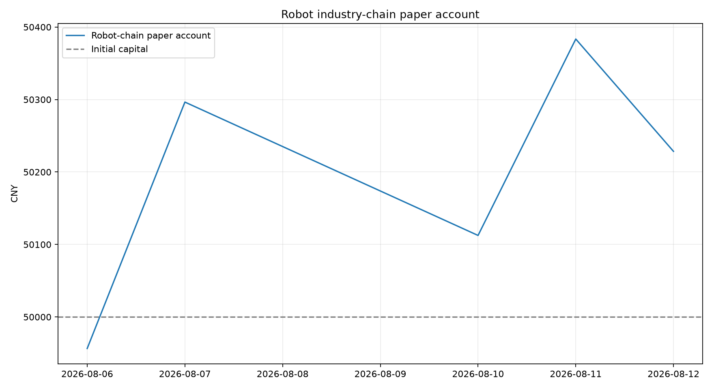

# 机器人产业链个股纸面账户日报

数据日期：**2026-08-12**

状态：**运行中**；只做模拟，不连接券商。

## 当日盈亏

| 初始资金 | 当前市值 | 累计盈亏 | 收益率 | 最大回撤 | 现金 |
|---:|---:|---:|---:|---:|---:|
| ¥50,000.00 | ¥50,228.49 | ¥228.49 | 0.46% | -0.37% | ¥22,927.49 |

- 股票市值：¥27,301.00（54.35%）
- 累计佣金：¥30.00；累计滑点：¥13.51
- 今日模拟动作：**持有**

## 当前持仓

| 代码 | 公司 | 产业链 | 股数 | 收盘价 | 市值 | 高于20日均线 |
|---:|---|---|---:|---:|---:|---|
| 002472 | 双环传动 | 上游 | 100 | ¥38.74 | ¥3,874.00 | 是 |
| 603728 | 鸣志电器 | 上游 | 100 | ¥52.51 | ¥5,251.00 | 是 |
| 002747 | 埃斯顿 | 中游 | 100 | ¥34.71 | ¥3,471.00 | 是 |
| 300024 | 机器人 | 中游 | 300 | ¥15.84 | ¥4,752.00 | 是 |
| 002698 | 博实股份 | 下游 | 300 | ¥13.93 | ¥4,179.00 | 是 |
| 603486 | 科沃斯 | 下游 | 100 | ¥57.74 | ¥5,774.00 | 是 |

## 风险规则

- 连续3日低于20日均线：下一交易日模拟减半。
- 组合回撤达到-8%：下一交易日将股票仓位降至35%以内。
- 组合回撤达到-12%：下一交易日全数转为现金观察。

## 口径与限制

- 这是用腾讯前复权日线、按收盘信号和次日开盘模拟执行的账户；首日按收盘价建仓。
- 该账户没有通过样本外 Alpha 验证，风控规则仅用于纸面复盘，不构成真实买卖建议。
- 纸面账户，未验证Alpha，不连接券商或自动下单。

